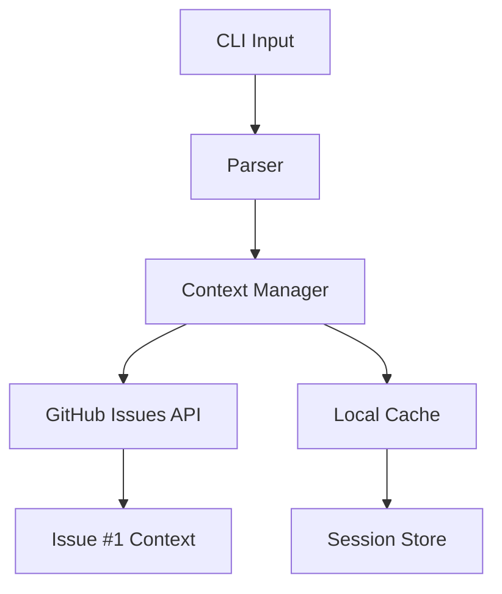

## Project Overview

**Name:** pos-print
**Type:** CLI visualization and terminal aesthetic
**Stack:** Python, CLI, terminal graphics
**Goal:** Build POS CLI Awareness System for productivity infrastructure
**Repo:** https://github.com/ai-mindset-org/pos-sprint

---

## Current Sprint

| Task | Status | Date |
|------|--------|------|
| POS Audit | ✓ Done | 2026-04-20 |
| Context Storage Research | ✓ Done | 2026-04-20 |
| GitHub Issues Integration | ✓ Done | 2026-04-20 |
| MCP Servers Fix | ◐ IP | 2026-04-20 |

---

## Architecture



---

## Key Decisions

| Decision | Date | Rationale |
|----------|------|-----------|
| GitHub Issues for context | 2026-04-20 | Single source of truth, API access, free |
| gh CLI for interaction | 2026-04-20 | Native GitHub integration, no auth hassles |
| Comments for history | 2026-04-20 | Immutable audit trail |
| Issue body for current state | 2026-04-20 | Easy to scan, structured format |

---

## Blockers

- MCP filesystem: Windows path format issue
- MCP linear: API key validation needed

---

## Quick Links

- **Dashboard:** `~/Desktop/pos-dashboard.html`
- **Global Rules:** `~/.claude/CLAUDE.md`
- **Project Rules:** `./CLAUDE.md`
- **AGENTS:** `./AGENTS.md`

---

## How to Update This Context

### Via gh CLI (recommended):
```bash
# Read current context
gh issue view 1 --comments

# Add comment (preserves history)
gh issue comment 1 --body "Update: Started work on X"

# Edit body (major updates)
gh issue edit 1 --body-file context.md
```

### Via Claude Code:
```
/context-update read      # Show current context
/context-update append  "Update: ..."  # Add comment
```

---

*Last updated: 2026-04-20*
